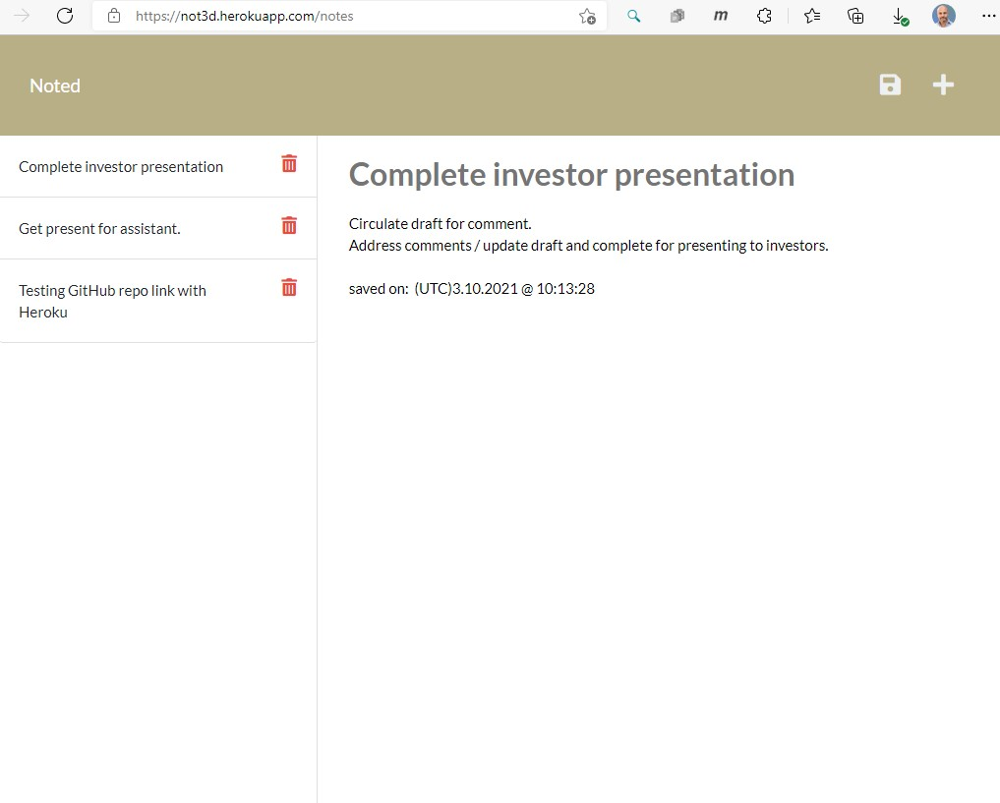

# USYD-FSF Week11 Project
## Express.js: Note Taker

### Table of Contents  
  
   1. [Project Description](#1-description)
   2. [Application Features](#2-features)
   3. [Installation](#3-installation)
   4. [Usage](#4-usage)
   5. [Credits](#5-credits)
   6. [License](#6-license)
   7. [Repository Status](#7-github-repo-status)
   8. [Contribute](#8-how-to-contribute)
   9. [Tests](#9-tests)
   10. [Checklist](#10-checklist)

---
### 1. Description  
**What is this project?**  
* Simple application demonstrating the benefits of server side data storage by allowing a user to write and save notes to organize and keep track of their tasks.

**Why this project?**  
* Demonstrates my understanding of building the back end of a web hosted application and my knowledge with deploying applications on Heroku.

   

**What problem does this project solve?**  
* Provides a place to write and keep notes that can easily be retrieved by revisiting the website, providing the save function for the note was completed beforehand.

**Lessons learnt?**  
* Easier to use Heroku's facility to connect to the GitHub repository instead of having to juggle pushing commits to both heroku and GitHub.
* Establish and maintain a good directory / folder structure for the application and follow it throughout development.
* Time stamp ended up being a pain as Heroku server's are understandably set to UTC so the time stamp is not local.  Messed around trying to adjust for local time but opted for the easier solution of marking the timestamp as UTC.  Could use Moment.js in future revision or a user settings area for them to provide their local time offset.

---
### 2. Features  
Client requested features as implemented:  
- has a landing page with a link to a notes page
- clicking on the link to the notes page present the user with a page with existing notes listed in the left-hand column, plus empty fields to enter a new note title and the note’s text in the right-hand column
- entering a new note title and the note’s text causes the 'Save' icon to appear in the navigation pane at the top of the page
- clicking on the Save icon has the new note just entered saved and appearing in the left-hand column with the other existing notes
- clicking on an existing note in the list in the left-hand column results in the note appearing in the right-hand column
- clicking on the Write icon in the navigation at the top of the page provides an empty field to enter a new note title and the note’s text in the right-hand column.
- for saved notes, clicking on the bin icon deletes the note entry from the saved notes.
- I disabled the 'read-only' for saved messages as I got the delete function to work so the user can easily delete the former note or repurpose it.  Messages are time stamped (UTC) to help them keep track of their notes.

---
### 3. Installation  
You can download the source code from [my Github repository](https://github.com/Mark33Mark/noted)  and open the index.html file to review the website inside your selected web browser.  
Alternatively, the webpage is hosted at [URL: https://not3d.herokuapp.com/](https://not3d.herokuapp.com/)

---
### 4. Usage  
The code can be downloaded from [my Github repository](https://github.com/Mark33Mark/noted) for all assets created for the project.  
You can modify the code as you need.
The application is hosted on [Heroku](https://not3d.herokuapp.com/)

---
### 5. Credits  
University of Sydney's Bootcamp Coding course for the starter code provided for the front end / client side.  There was no back end code provided.  All back end coding was by me and I completed some refactoring of the front end.  Thanks to Bootcamp for a well thought out and coded client side.

---
### 6. License  
 The works in this repository are subject to:  

---
### 7. Github repo status  

---
### 8. How to Contribute
 If you would like to contribute, please comply with the Contributor Covenant Code of Conduct:  

---
### 9. Tests  
- No unit test have been prepared for this project.  Testing on devices completed.  I wanted to but ran out of time.

---
### 10. Checklist  
 All actions not checked are still to be completed:

* [x]  Application front end connects to an Express.js back end.
* [x]  Application back end / server side stores notes with a unique id in a JSON file.
* [x]  Application is deployed live on Heroku with [URL: not3d.herokuapp.com](https://not3d.herokuapp.com/)
* [x]  Application loads with no errors.
* [x]  GitHub repository contains application code [Github location](https://github.com/Mark33Mark/noted)
* [x]  The GitHub repository contains all the application code.
* [x]  Application console is free of errors.
* [x]  Repository has a unique name; follows best practice for file structure; and naming conventions.
* [x]  The application resembles the mock-up functionality provided in the assigment instructions.
* [x]  Repsository follows best practices for class/id naming conventions, indentation, quality comments, etc.
* [x]  Repository contains multiple descriptive commit messages.
* [x]  Repository contains a README file with descriptio, screenshot and link to deployed application.
* [x]  Application allows user to delete notes.

---

- [Back to the top](#usyd-fsf-week11-project)